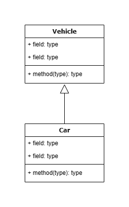
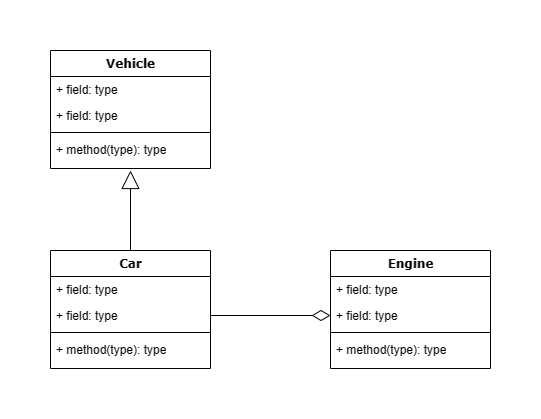

# Introduction to Java Programming language

> "Java is a very general-purpose language. It’s designed to span many different domains. You can write server-side programs; you can write apps for mobile phones; you can write scientific programs; you can write software that travels between planets."
>
> <cite>James Gosling, Founder and lead designer of the Java programming language</cite>


In 1991, a project called "Green" was started in Sun Microsystems. The goal of this project was to create a programming language that can run on all hardware. This goal was a very big goal. This project was called "Java" at the end of the work. When Java was being developed, C and C++ dominated other programming languages. However, their major weaknesses plague many programmers. For example, if you wanted to write a program in C language and run it on computers made by different companies, you would have to compile its source code in each of the machines and run the executable code in the desired machine. So far, the problem was not very difficult, but the point was that you had to change the source code every time to compile the program. In addition, you had to always maintain several different versions of the source code, which greatly increased the cost of software production.

In 1995, the first version of Java language was introduced to the world along with a shocking technology called Applet. The new language claimed to work on all existing operating systems. You don't need to create and maintain different source codes for your application. The motto of the new language was "Write Once, Run Anywhere". A new language had come to shape the future of the web. The new language gave everyone hope. It did not have the major drawbacks of previous languages such as C and C++, and therefore it was welcomed by programmers all over the world.

This language followed its natural course and changes were made according to the opinions of the programmers. However, Java strongly believed in adhering to its motto and was able to defend its claim with authority. In 1999, Sun divided the Java language into three main branches:

* Java 2 Standard Version or J2SE: This branch contains all the standard features of the Java language.
* Java 2 Enterprise Edition or J2EE: This branch is for server-side programming.
* Java 2 micro version or J2ME: This branch is for programming consumer electronic devices such as mobile phones.

The natural growth of Java continued and every now and then new versions and modifications of Java were introduced to the programming community. 

In 2005 Sun decided to change its naming convention. The name of the Java language along with its version number would be something like j2sdk_1.4.06. After this year and due to the many changes made in the Java language, this language chose the name Java 5.

The three main branches of the Java language were also renamed while maintaining the previous goals and features. The new names for each are as follows: Java SE or Java Standard Edition, Java EE or Java Enterprise Edition and Java ME or Java Micro Edition.

TODO: Java Open Source

TODO: Oracle Acquisition of Sun Microsystems
In 2009 Oracle acquired Sun Microsystems ...

Since that year Oracle has presented a new version of Java language every year. Currently, the latest long term supported (LTS) version of Java is Java 17. 

# Java, JDK, JRE and JVM

# Install Java

## About Java Versions

# First Java Application
It is time for a cup of "Java"! We already have installed Java. We don't want to use any IDE for our first Java program! So, Open your preferred text editor (For example Notepad in windows) and write this code (please, do not copy for this time!):

```java
public class FisrtCupApp {
    public static void main(String[] args) {
        System.out.println("My first cup of Java!");
    }
}
```

Save the file with `FisrtCupApp.java`. 

Warning: The file name must be as the same as clss name. It is case-sensitive and, for example `FisrtCupApp.java` is different with `FisrtcupApp.java` and the second one won't compile.

Now, it is time to compile our Java program. Open your terminal (in windows, open `Command Prompt`), change directory to the `FisrtCupApp.java` directory and then run this command:

```
javac FisrtCupApp.java
```

After successfull compile, you will see a new generated file: `FisrtCupApp.class`. This is compiled version of our app that we can run it on every machine with Java Runtime Environment (JRE) installed.

To run the program, run this command in the terminal:

```
java FisrtCupApp
```

If everything goes well, you can see a message in your terminal:

```
My first cup of Java!
```

This program includes one `class`. Classes are the main building block of Object Oriented Programming (OOP). 

In this class, there is a method called main(). This method is the starting point of all Java programs. The Java Virtual Machine (JVM) executes this method to start a Java program, and as soon as this method is finished, the execution of the program ends. 

Inside this method there is a statement. Running this line will show `My first cup of Java!` in the output window.

# Java Class Structure

# Java Data Types

In any program we deal with a number of values. The program may work with numbers, or with characters. For example, suppose we want to take two different numbers from the input in a program, perform mathematical operations on them, and print the result in the output. We call this program `SimpleCalculator`:

```java
/**
 * A very simple calculator.
 */
public class SimpleCalculator {
    public static void main(String[] args) {
    }
}
```

Now we need to change the program so that it can store two numbers with different names and values:

```java
/**
 * A very simple calculator.
 */
public class SimpleCalculator {
    public static void main(String[] args) {
        int first;
        int second;        
    }
}
```
Now our `main()` method has two variables called `first` and `second`. In programming terms, `first` and `second` are called `variables`. 

As you have seen so far, each variable contains a name and a type. In the `SimpleCalculator` example, we have two variables named `first` and `second`, both of which are `int` type. 

Each variable has a value in addition to name and type. Now we want to modify the `SimpleCalculator` class so that we can initialize our variables:


```java
/**
 * A very simple calculator.
 */
import java.util.Scanner;
 
public class SimpleCalculator {
 
    public static void main(String[] args) {
        int first;
        int second;
 
        Scanner input = new Scanner( System.in );
 
        System.out.print("Enter first integer: ");
        first = input.nextInt();
 
        System.out.print("Enter second integer: ");
        second = input.nextInt();
    }
}
```

For now, we have nothing to do with the `Scanner` class. Just know that we use the methods of this class to read the inputs of the program. 

After running the above program, the phrase `Enter first integer:` is displayed in the output console and you can enter the desired value in front of it. Then the next line will be displayed with the phrase `Enter second integer:` where you can enter the value you want for the second variable. 

Now we perform some mathematical operations on these two numbers and print the result in the output:


```java
/**
 * A very simple calculator.
 */
import java.util.Scanner;
 
public class SimpleCalculator {
 
    public static void main(String[] args) {
        int first;
        int second;
 
        Scanner input = new Scanner( System.in );
 
        System.out.print("Enter first integer: ");
        first = input.nextInt();
 
        System.out.print("Enter second integer: ");
        second = input.nextInt();
 
        System.out.println("first + second = " + ( first + second ) );
        System.out.println("first - second = " + ( first - second ) );
        System.out.println("first * second = " + ( first * second ) );
        System.out.println("first / second = " + ( first / second ) );
    }
}
```

The purpose of any computer program is to process data. For this, any program must be able to input data, process it, and display the result appropriately. 

To process data in the program, we need to be able to identify the data. We need to know what kind they are. We also need to know how much each of them has at any given moment. 

As you saw in the previous program, we assign three attributes to each variable: type, name and value. The general pattern of variable definition (also called declaration) in Java language is as follows:

```java
Type name;
```

After defining a variable, we must be able to assign a value to it. For this, we use the following pattern:

```java
name = Value;
```

If we want, we can do two steps of defining the variable and assigning a value to it in one command:

```java
Type name = Value;
```

Now some examples of declaring variables and assigning values to them:

```java
int a = 5;                   // An integer variable with value 5
char someChar = 'A';         // A character variable with value 'A'
double PI = 3.14;            // A floating point number with value 3.14 
String hello = "Hello Java"; // A String with value "Hello Java"
```

## Java Primitives
After getting acquainted with variables and how to define and value them, we can see the complete list of Java primitive data types:

| Syntax      | Range of allowed values                          | Description  |
| ----------- | -----------------------                          | ------------ |
| boolean     | `true` and `false`                               | Suitable for logical variables that always have one of two values, true or false |
| char        | From Unicode's zero to 2<sup>16</sup>-1 unicode  | Suitable for all types of literal variables. Considering that letter variables in Java Unicode are 16-bit, they can be used for all letters of all languages.|
| byte        | From -128 to 127                                 | Suitable for integer variables that are within the limit of allowed integer values. |
| short       | From -2<sup>-15</sup> to 2<sup>15</sup>-1        | Suitable for integer variables that are within the limit of allowed integer values (around -32,000 to +32,000).|
| int         | From -2<sup>-31</sup> to 2<sup>31</sup>-1        | Suitable for integer variables that are within the limit of allowed integer values (around -2,000,000,000 to +2,000,000,000).|
| long        | From -2<sup>-63</sup> to 2<sup>63</sup>-1        | Suitable for very, very large integer variables! |
| float       | IEEE754 (approx 3.4E38- to 3.4E38 with 8 digits of decimal precision)         | Suitable for floating point numbers with good precision for routine calculations |
| double      | IEEE754 (Approximately from 1.8E308-up to 1.8E308 with 16 digits decimal precision)   | Suitable for very high precision floating point numbers for double precision calculations |
| void        | No-Value        | For variables that have no type (we'll talk more about the `void` type later) |

## Java Wrapper classes for Primitive Types

## Literal Varialbles

In some Java programs you may want to use values directly. Consider the following statement:

```java
int a = 5;
```
In the above example, the number 5 is a literal variable. The Java compiler has some rules for literals. For example, it recognizes correct literal variables like the above example by default of `int` type. Now, if you want to assign the number 5 to a long variable in an assignment command using the = operator, you must do the following:

```java
long a = 5L;
```
The letter `L` immediately after the number 5 tells the Java compiler that the literal variable 5 is of `long` type. Also, the default for floating point literals in Java is of `double` type. Consider the following line of code:

```java
float a = 3.14;
```
Do you think this line code will compile? Try it! As you may have guessed and probably tested your guess, the Java compiler throws an error when executing the above code:

```
possible loss of precision
found:    double
required: float
float a = 3.14;
          ^
1 error
```
Did you get the cause of the error? The literal variable 3.14 is assumed by the Java compiler to be `double` by default. When it wants to put its value in a floating point variable of type `float`, the precision of the `double` must be reduced to `float`, and this is an error from the Java compiler's point of view. 

To solve this problem, you must explicitly tell the Java compiler that 3.14 is a `float` literal. For this, we do the same as the following command:

```java
float a = 3.14F;
```
The letter `F` immediately after 3.14 forces the Java compiler to consider the literal variable 3.14 to be of `float` type.

## Strings

Our variables are not always numeric types. In many cases, we need to input letters and words into our program, process them and display the result as a word or sentence. 

For example, suppose we have a program that takes the name of a student from the input and displays his/her grade. We need a variable in which we can store the name of the student. 

These types of variables are called `String`s. The Java language has extensive facilities for working with strings, which we will disscuss more in next chapters.

To define a string variable, proceed as follows:

```java
String name;
```

Of course, like other types of variables in Java language, it is possible to initialize it at the same time as defining a string variable in Java:

```java
String name = "Some text";
```
`String`s  are always placed between double qoutes.

## Java String handling

### String Length

### Concatenating Strings

### Format Strings

### Substrings

### Compare Strings

## Java StringBuilder


## Text Blocks

From Java 15, we have text blocks in Java! You can define a text block by wrapping your text inside `"""` (three double qoutes) as below:

```java
String html = """
    <html>
        <body>
            <span>example text</span>
        </body>
    </html>""";
```

## Constant Variables

Constant Variables are variables whose value cannot be changed! This definition is self-contradictory enough. A variable means something that changes, so a variable whose value cannot be changed is meaningless. 

But if we stop playing with words, we can see that many times in programs we may define variables that we don't want their value to change during the execution of the program, intentionally or unintentionally. 

For example, suppose we use the number pi (π) in mathematical calculations. The value of this variable should not change during program execution. For this we define this variable as `final`:

```java
final double PI = 3.14;
```

## Java Arrays

Suppose you want to take the grades of students in a class and calculate their average. The number of students in the class is 25. Are you defining 25 float variables? What would you do if there were 50 students in the class? What would you do for 200 people? 

As you might guess, the solution is not to use too many variables. If we could store a large number of variables of the same type with the same name and access them using an index, the problem would be solved. 

For example, we used to say that the list of students' grades includes 25 float variables, and then we said that the first student's grade is 15 and the second student's grade is 16, and so on. 

Such a data type is called an array. Array is a set of variables called element and all of them are of the same type. 

An array is identified by several things: its name, the number of variables it holds, called the length of the array, and the type of variables the array holds. 

Therefore, to define an array that stores students' grades, we act as follows:

```java
float[25] grades;
```
Pay attention to the parts of the above definition: 
`float` Specifies the array type. It actually says that the above array holds float elements. 

`[25]` declares that the length of the array is 25. [] represents the array and the integer inside it specifies the length of the array. 

`grades` is the name of the array. 

Now, if we want to value the elements of this array, we act as follows:

```java
grades[0] = 12.3f;
grades[1] = 15.5f;
// ...
grades[24] = 16f;
```
In Java, array index starts from 0. So in an array with 25 elements, the first item's index in 0 and latest item's index is 24.

## Naming rules for Variables

Naming variables in Java has limitations. Variables start with letters (a-z and A-Z) and an underscore (`_`) and can be followed by any number of letters or numbers.

Some examples of incorrect names for variables in Java:

```java
int 1i; // Wrong name
String #name = "My Name"; // Wrong name
```
However, there are rules for naming variables in the Java language that are not mandatory, but most Java programmers have accepted them, and of course it is recommended as a correct coding pattern in Java. Some of these rules are:

Variable names start with a lowercase letter. If the variable name is more than one word, the words are concatenated and the first letter of the second and subsequent words are capitalized. This naming method is known as Camel case. Some examples of good and bad names:


```java
int number;          // Good name!
int second_number;   // Bad name!
int secondNumber;    // Good name!
String Name;         // Bad name!
String name;         // Good name!
float _average;      // Bad name!
```

Constant variables (final) are usually written in capital letters and if the number of words is more than one word, they are separated by a underscore (-):

```java
double PI = 3.14;
String URL = "https://behzadian.info";
String DB_URL = "jdbc:mysql://127.0.0.1:3306/testDB";
```

## Variables Scopes

Variables are valid only in the same scope in which they are defined. For example, if we define a variable inside a method, we don't have access to it in other methods and we can't see its value or change it. See the example:

```java
public class VariableScopeTest {
 
    public void firstMethod() {
        int myNumber = 5;
    }       
 
    public void someMethod () {
        myNumber = 10; //?
    }
}
```
In this example, a variable named `myNumber` is defined and initialized in the `firstMethod` method. Although both `firstMethod` and `someMethod` belong to the same class, in `someMethod` we have no access to `myNumber` variable. If you try to compile the above class, the compiler will give you an error:

```
can not find symbol
symbol  : variable: myNumber
location: class VariableScopeTest
                myNumber = 10; // ?
                ^
1 error
```

The reason is quite clear: a variable defined in a method belongs to that method and does not exist outside of it. Therefore, we do not have access to it in other methods.

The variables' scope in Java language is divided as follows:

**Class scope**: Class properties are variables that are accessible throughout a class. For example, if a variable is in the scope of a class, all the methods of that class have access to it, and any of the methods that change that variable will change its value in other methods as well.

**Method scope**: These are variables that are defined in a method. These variables can only be accessed in the method in which they are defined.

**Block scope**: Sometimes we define variables inside iteration loops or some other conditional structures inside a method. These variables are not accessible outside that block. See the example:


```java
public class VariableScopeTest {
 
    public void someMethod () {
        for( int i = 0 ; i < 10 ; i++ ) {
            // Do something
        }       
 
        // Now what is i's value?
        System.out.println( "i = " + i );
    }
}
```

In the example above, the variable `i` is defined in the for loop. When we try to print the value of `i` to the output, we get an error:

```
can not find symbol
symbol  : variable: i
location: class VariableScopeTest
                System.out.println( "i = " + i );
                                             ^
1 error

```
The reason is that the scope of the variable `i` is only the for loop, and there is no variable `i` outside of it.

An important issue that needs to be explained in the field of variables is the issue of names of variables. Is it possible to have two variables with the same name? it depends! 

This is possible if the variables of the same name are in different scopes. For example, if a class has an attribute named someInt and one of the methods of that class has a variable with the same name, there is no error. 

The only important thing is that the variables of the same name are valid in the same scope in which they are defined. See the example:


```java
public class VariableScopeTest {
 
    int someInt;
 
    public void someMethod () {
        int someInt;
        someInt = 5; // ?
    }
}
```
In the above example, a variable named `someInt` is defined in the `VariableScopeTest` class and is among the properties of that class. A variable called `someInt` is also defined in the `someMethod` method. 

Now, what happens if we assign the value `5` to the `someInt` variable in the `someMethode` method? Does the variable defined in the function change or the property of that class? 

To answer this question, it should be noted that priority is given to the domain in which the variable is defined. So if we assign the value `5` to someInt, the variable defined in the method will change, not the class property of the same name. 

Now, what should we do if we want to change the class property called `someInt` in the `someMethod` method? For this, it is enough to use `this` keyword. See the example:

```java
public class VariableScopeTest {
 
    int someInt;
 
    public void someMethod () {
        int someInt;
        someInt = 5; // Method variable
        this.someInt = 7; // class variable
    }
}
```

# Java Operators

## Expression

You must have seen many mathematical expressions by now. For example, you know that `2+2` is a mathematical expression. There are also such expressions in programming languages. 

If we want to be more precise, we should say that any statement that has a "value" is an expression. some mathematical expressions:

```java
int x = 5;
int y = x;
int z = x * y;
```

All the statements above are "expressions" because each of them has a value: in the first line the value of the literal variable 5 is assigned to a variable of type int named x, in the second line the value of the variable x is placed in a variable named y, and In the third line, the value of the product of two variables x and y is placed in the variable z. So 5, x and x * y are each a mathematical expression.

The value of an expression is called the return value. For example, if x is an `int` variable with an initial value of `3` and y is an `int` variable with an initial value of `5`, then the return value of the expression `x * y` is equal to the product of two numbers `3` and `5`, i.e. `15`. See the example:

```java
int x = 3;
int y = 5;
int z = x * y;
// If you print value of z,
// you will see that the value is: 15 (= 3 * 5)
System.out.println( "z value:" + z );
```

As you know, in most mathematical expressions we use symbols like `*` (multiplication), `+` (addition) and so on. In programming terms, these special symbols are called `operators`. Operators are symbols that are used for mathematical and logical calculations. Below, we will talk more about different types of operators.

## Arithmetic Operators

To perform mathematical calculations in Java, we use five operators: `addition` (`+`), `subtraction` (`-`), `multiplication` (`*`), `division` (`/`) and `modulus` (`%`). In the table below, you will see the list of these operators along with examples of their use:

| Operator | name           | Example  | Value |
| ----     | ----           | ----     | ----  |
| +        | addition       | 5 + 7    | 12    |
| -        | subtraction    | 9 - 3    | 8     |
| -        | Negative       | -5       | -5    |
| *        | multiplication | 3 * 2    | 6     |
| /        | division       | 15 / 3   | 5     |
| %        | modulus        | 8 % 3    | 2     |

Mathematical operators can be classified in different ways. One of the common types of operator classification is the classification of operators based on the number of their operands. 

For example, the four basic mathematical operations each have two operands. In the example of the above table, `5` and `7` are the operands of the expression `5 + 7`. 

Most Java operators are of one or two operand type and there is only one three operand operator in Java, which we see it in the next section.

Note: One of the points that should be considered when using the division operator (/) is the type of variable in which the result of division is supposed to be placed. 

If the division result is stored in an `int` type variable, the division result is rounded to the largest integer smaller than the result. See the example:

```java
int x = 16;
int y = 5;
int z = x / y;
System.out.println( "z is: " + z ); // z = 3.2 ?
```

If you do the above division with a calculator, the result of subtraction will show 3.2 whereas if you run the above program, you will see the value of 3 in the output. The reason is clear, the z variable is defined as an int type and cannot store a decimal value. Now we make a change in the above program and rewrite it as follows:

```java
int x = 16;
int y = 5;
float z = x / y;
System.out.println( "z is: " + z ); // z = 3.2 ?
```

Now what do you think will be printed on the output? 3.2 or 3? Try! Yes, after running the above program, you will see 3.0! but why? 

This time the `z` variable was defined as a `float` type? In the explanation of this article, it should be said that because both operands of the division operator are of int type, the Java compiler puts the result of division in an `int` variable and then puts it in the `z` variable. 

To solve this problem, two solutions can be used: defining the operands of the division operator of `float` type or forcing the compiler to perform decimal division. Let's see the first solution together:

```java
float x = 16.0f;
float y = 5.0f;
float z = x / y;
System.out.println( "z is: " + z ); // z = 3.2 !
```

After running the above program, the result of division will be 3.2. In this method, due to the fact that both operands of the division operator are `float`, the result of division is also a `float`. 

But what should we do if we want to divide two `int`s and see the result as a `float`? For such cases, we use the second method. 

In this method, which is known as "type casting", one of the operands of the division operator is given to the `float` type. See the example:

```java
int x = 16;
int y = 5;
float z = (float)x / y;
System.out.println( "z is: " + z ); // z = 3.2 !
```

In the third line of this example, before doing the division, we change the type of variable `x` and convert it to a float variable. After this conversion, the division operator, due to the fact that one of its operands is of `float` type, becomes a `float` division operator and the result of dividing a `float` number.

## Assignment Operator

We are all familiar with the assignment operator. The main task of this operator is to assign the value of the expression on the right (right operand) to the variable (operand) on its left side. 

According to the above definition, the operation of assigning a value to a variable is itself a mathematical expression because it has a value. 

This property allows us to chain several assignment operators and write several expressions in one simpler expression. Example:

```java
int x = y = z = 10;
```

According to the property of the assignment operator, the above expression is valid in Java language and its meaning is that all three variables `x`, `y` and `z` have an initial value of `10`. The above expression is equivalent to the following expressions:

```java
int x;
int y;
int z = 10;
y = z; // y = 10
x = y; // x = 10
```

To calculate the value of an assignment expression, the value of the right operand of the assignment expression is always calculated first, and then the result of this expression is placed in the left operand. With the help of this property, you can write attributive expressions in the following form:

```java
int x = 5;
x = x + 10; // x = 5 + 10
```

In the second line of the above example, first the expression x + 10 is determined. Since the initial value of x is equal to 5, the result of the above expression is equal to `5 + 10` or `15`. 

Then this value is placed in the `x` variable. After that, the value of variable `x` is equal to `15`. Changing the value of a variable using the current value of the variable is a very common in programming. 

For this purpose and for the simplicity of operations and more readability of the code, there are several new assignment operators in the Java language, which are shown in the following table with examples:

| Operator | Example  | Equivalent  |
| ----     | -----    | ----        |
| `+=`     | `x += y` |	`x = x + y` |
| `-=`     | `x -= y` | `x = x - y` |
| `*=`     | `x *= y` | `x = x * y` |
| `/=`     | `x /= y` | `x = x / y` |


Note: Always be careful when using the above shortcut assignment operators. If the right-hand side expression is complex, you may have unwanted errors in your calculation expressions that are usually not easy to find and fix. See the example:

```java
int x = 20;
int y = 5;
// ...
x = x / y + 5;
x /= y + 5;
```

Do you think the above two expressions are equal? In the above expression, the result of `x / y` is first calculated, and then the value of the result of division is added by the number `5`, and the result of this addition, which is `9`, is placed in the `x` variable. 

But in the second expression, first the result of `y` is added by `5`, then `x` is divided by this sum, i.e. `x = x / (y + 5)`

## Increment/Decrement Operators

In programming, it happens many times that we want to decrease or increase the value of a variable by one unit. For this, we can simply use any of the following expressions:

```java
int x = 20;
x = x + 1;
 // or
x += 1;
```

But in the Java language, there are two special operators for this purpose: increment operator (`++`) and decrement operator (`–-`). 

These two operators can be placed without spaces before or after the variable so that one is added to the value of the variable or one is subtracted from the value of the variable. See the examples:

```java
int x = 20;
 
x++; // x = x + 1
 // or
++x; // x = x + 1
...
x--; // x = x - 1
 // or
--x; // x = x - 1
```

If increment or decrement operators are placed before the variable name, they are called pre-increment or pre-decrement operators. In the same way, the single increment or decrement operators that are placed after the variable name are called post-increment or post-decrement operators.

The difference between pre-increment and post-increment operators is very subtle. In a mathematical expression, if the pre-increment operator is used, first this operator is calculated and adds a value to the desired variable, and then this new value of the variable is used in calculations. 

The function of the pre-decrement operator is similar, in that first the desired variable is reduced by one unit and then this new value of the variable is used in the calculations.

The function of the post-increment operator and the post-uniform decrement operator is that first the mathematical expression is fully calculated and at the end of the calculation, one unit is added to the desired variable or one unit is subtracted from the desired variable. See the example:

```java
int x = 20;
int y;
 
y = x++; //(1)
 // or
y = ++x; //(2)
...
y = x--; //(3)
 // or
y = --x; //(4)
```

In expression (1), first, the value of `y` becomes equal to the current value of variable `x`, i.e. 20, and then one unit is added to variable `x`. This expression is equivalent to writing:

```java
//(1)
y = x;
x = x + 1;
```

In expression (2), first one unit is added to variable `x` and then the expression `y = x` is evaluated and calculated. This expression is equivalent to writing:

```java
//(2)
x = x + 1;
y = x;
```

In expression (3), first, the value of `y` becomes equal to the current value of the variable `x`, i.e. 20, and then one unit is subtracted from the variable `x`. This expression is equivalent to writing:

```java
//(3)
y = x;
x = x - 1;
```

And finally, in expression (4), first one unit is subtracted from the variable x, and then the expression y = x is evaluated and calculated. This expression is equivalent to writing:

```java
//(4)
x = x - 1;
y = x;
```

## Comparison operators

Java has operators for comparing variables, literals variables and other types of data. The result of these operators is a `Boolean` variable that always has the value `true` or `false`. The following table contains a complete list of Java comparison operators and examples of each:

| Operator  | Meaning               | Example   | Description                                                                           |
| -         | -                     | -         | -                                                                                     |
| ==        | Equality              | `x == 5`  | If x is equal to 5, the result of the statement is `true`, otherwise it is `false`    |
| !=        | Not Equality          | `x != 5`  | If x is equal to 5, the result of the expression is `false` and otherwise it is `true`|
| <         | Less Than             | `x < 5`   | If x is less than 5, the result is `true`, otherwise it is `false`                    |
| >         | Greater Than          | `x > 5`   | If x is greater than 5, the result is `true`, otherwise it is `false`                 |
| <=        | Less Than or Equal    | `x <= 5`  | If x is less than 5 or equal to 5, the result is `true` and `false` otherwise         |
| >=        | Greater Than or Equal | `x >= 5`  | If x is greater than 5 or equal to 5, the result is `true` and `false` otherwise      |

An example of the use of comparative operators:


```java
boolean hip;
int age = 32;
 
// (1)
hip = (age < 25);
 
// (2)
hip = ( age == 32 );
 
// (3)
hip = (age != 32 );
```

In the above example, we first define a `boolean` variable and then an `int` variable with an initial value of `32`. 

In the first statement, the boolean `hip` variable value is `false`, because the age variable value is not less than 25. Actually, `32 < 25` is not. 

In the second expression, the value of `boolean` variable `hip` is `true` because the value of `age` is equal to 32 and `32 = 32`. 

The value of the third expression is `false` because this expression checks whether the `age` variable is opposite to 32 or not. And because the value of age variable is not opposite to 32, the result of the expression is false.

The main use of comparative operators is in conditional and control expressions, which we will discuss in detail in the next sections.

## Logical Operators

Expressions that result in a boolean value can be combined to form more complex expressions. Logical operators can be used to combine these expressions. These operators are AND, OR, NOT, and XOR. The following table contains Java logical operators and descriptions and examples for each of them:

| Operator | Meaning | Example  | description |
| ---      | ---     | ---      | ---         |
| `&&`     | AND     | `A && B` | If both expressions are `true`, it is `true`, otherwise it is `false`. |
| `||`   | OR      | `A && B` | If one of the two expressions is `true`, it is `true`, otherwise it is `false`. |
| `!`      | NOT     | `!A`     | If A is `true`, this is `false` and if A is `false`, then it is `true` |


In the following example, we want to give a written warning to students whose grades are between 10 and 12. For this we need to combine two conditional expressions:

```java
double grade = // ...
boolean warning = (grade > 10.0) && (grade < 12.0);
```
## Bitwise Operators

| Operator | Meaning              | Example | description |
| ---      | ---                  | ---     | --- |
| `&`      | Bitwise AND          | -       | - |
| `|`     | Bitwise Inclusive OR | -       | - |
| `^`      | Bitwise Exclusive OR | -       | - |

## Operator Precedence

What is the result of the following expression?

```java
int x = 6 + 4 / 2;
```
Is the value of variable `x` equal to 5 or 8? To answer this question, we need to know which operators are evaluated first and which ones are evaluated later. If `+` is evaluated earlier than `/`, the result of the expression will be 5, and if `/` is evaluated earlier, the result of the expression will be 8. 

As you remember from your math lessons, some operators have a higher priority than other operators and whenever they are included in an expression, their result is calculated first and then other operators are evaluated. Java also uses the operator priority table to perform its calculations, where each operator has a priority. See the operator precedence table in Java:

| Operator | Description |
| --- | --- |
| `.` <br/>`[]` <br/>`()`                                              | Access Method Operator <br/> Array Index Operator <br/> Paranthesis in expressions to group some expressions together|
| `++` <br/>`--` <br/>`!` <br/>`~` <br/>`instanceof`                   | Increment Operator <br/> Decrement Operator <br/> Logical Not <br/>Bitwise Complement <br/>Binary Operator for Type Checkeing |
| `new` <br/>`()`                                                      | Creates new instance of an object <br/>Type Casting Paranthesis |
| `*`  <br/>`/`  <br/>`%`                                              | Multiplication <br/>Division <br/>Modulus |
| `+` <br/>`-`                                                         | Addition <br/>subtraction |
| `<<`  <br/>`>>`  <br/>`>>>`                                          | Signed Left Shift <br/> Signed Right Shift <br/>Unsigned Right Shift  |
| `<`  <br/>`>`  <br/>`<=` <br/>`>=`                                   | Less Than <br/> Greater Than <br/>Less Than or Equal <br/>Greater Than or Equal |
| `==`  <br/>`!=`                                                      | Equlity <br/>Not Equality |
| `&`                                                                  | Bitwise AND |
| `^`                                                                  | Bitwise XOR |
| `|`                                                                  | Bitwise OR |
| `&&`                                                                 | Logical AND |
| `||`                                                                 | Logical OR |
| `?:`                                                                 | Conditional Operator |
| `=`  <br/>`+=`  <br/>`-=` <br/>`*=`  <br/>`/=`  <br/>`%=`  <br/>`^=` | Arithmetic Assignments |
| `&=`  <br/>`|=`  <br/>`<<=` <br/>`>>=`  <br/>`>>>=`                  | Bitwise Assignments  |


# Java Control Structures

Computer programs written in any programming language—including Java—consist of three main components that control program execution:
* Sequence
* Selection
* Repetition

Sequence: Sequence means executing the program commands consecutively. See the example:

```java
int a = 10;
int b = 10;
int c = a + b;
System.out.println( "a + b = " + c );
int d = a * b;
System.out.println( "a * b = " + d );
```

You may ask if there is another way? Many old programming languages have commands to break this law. Commands like `jump` or `goto`. In Java we have two commands that are against this rule, but are very limited and under control: `continue` and `break`. You will see them very soon.

Selection: 
## Selection in Java

Sometimes we want to choose the program execution path from several different paths. For example, we want to reward the student if his score was higher than 18, warn him/her if it was between 60 and 70, and fine him if it was between 50 and 60. As you can see, the "activity" related to each of the above choices is different from the other. Pay attention to the following algorithm:

```
If the student's score is greater than 70:  
    Reward the student  
If the student's score is between 60 and 70:  
    Warn the student  
If the student's score is between 50 and 60:  
    Fine the student
Otherwise
    Reject Student
```

Java uses several different methods for the selection structure, which we will see in next sections:

* The if structure
* if-else structure
* Switch structure


### If Statement

There are times when we want to execute a statement if a condition is `true`, and if the condition is `false`, continue the program regardless of the statement. 

For example, if the student's score was more than 50, we want to write "passed" in his report:

```
If the student's score is more than 50
    Write "Passed"
```
In the above algorithm, if the condition is `true`, i.e. the student's score is more than 50, the internal statement will be executed and then the next statement after `if` statement will be executed, but if the condition is `false`, statement inside `if` will not be executed and The program just skip it.

For single selection in Java, we use the `if` statement:

```java
if(condition)
    statement;
```

In the above syntax, `condition` is any logical expression whose return value is `true` or `false`. `statement` can also be any Java statement. If the number of internal statements of the if command is more than one statement, we use the following form for the if command:

```java
if(condition) {
    statement1;
    statement2;
    statement3;
}
```
As we said, the `condition` can be any logical expression with a return value of `true` or `false`. Therefore, logical statements can be combined in the if statement:

```java
if(condition1 && (condition2 || condition3)) {
    statement;
}
```

Examples of the if statement:

```java
int a = 5;
int b = 7;
int c = a + b;
if( c > 10 ) {
    System.out.println( "a + b is greater than 10!" );
}
```
In the above `if` statement, the condition is whether the sum of `a + b` is greater than 10 or not, and since the above sum is greater than 10, the condition is true and the internal if statement is executed and the statement "a + b is greater than 10!” It is printed in the output.


```java
int a = 5;
int b = 7;
if( ( a * b ) > 40 ) {
    System.out.println( "are you sure that (a * b) is greater than 40?" );
}
```

In the `if` statement above, the condition checks whether the product of a and b is greater than 40 or not, and since the value of this product is less than 40, the condition is `false` and the internal statement will not be executed.

### If-Else Statement

In the `if` statement, if the condition is true, the internal statements are executed, and otherwise, the program skips over these statements and executes the statements after if. 

There are times when we want to execute a special statement if the condition of the `if` statement is false. For example, see this algorithm:

```
If the student's score was more than 50
    write "passed"
otherwise
    write "failed"
```

In Java, we use the if-else command in such cases:

```java
if(condition)
    statement1;
else
    statement2;
```

In the above example, if the condition is `true`, the `statement1` will be executed. But if the condition is `false`, `statement2` will be executed.

As we said before, if the number of internal statements of the `if` or `else` is more than one, we use the following form:

```java
if(condition) {
    statement1;
    statement2;
    statement3;
    ...
} else {
    statement4;
    statement5;
    statement6;
    ...
}
```

The `if` and `else` internal statements can be any allowed Java statement, so you can use nested `if` and `else` as below:

```java
int a = 5;
int b = 7;
if(a != 5) {
    System.out.println("a != 5");
} else {
    if( b == 7 ) {
        System.out.println("a = 5 and b = 7");
    }
}
```

Look carefully at the code snippet above. As you can see, an `if` statement is placed inside an `else` statement. For more simplicity, they can be combined and written as follows:

```java
int a = 5;
int b = 7;
if( a != 5 ) {
    System.out.println("a != 5");
} else if( b == 7 ) {
    System.out.println("a = 5 and b = 7");
}
```

In the example above, the condition of the `if` statement is checked first. If the `if` condition is `false`, then the `else if` condition is checked, if the `else if` condition is `true`, the internal `else-if` statements are executed, otherwise the execution of the program continues from the first statement after the `else-if`.

It is possible to nest `else-if` more. Consider the following example:

```java
if(condition1) {
    statement1;
} else if(condition2) {
    statement2;
} else if(condition3) {
    statement3;
} else {
    statement4;
}
```

In the above example, if `condition1` is `true`, `statement1` will be executed. If `condition2` is true, `statement2` will be executed and ... and if none of the above conditions are true, `statement4` will be executed. Of course, the last `else` is optional and we only add it if we want to execute certain commands if all the conditions are `false`.

### Switch Statement

A multiple choice statement in Java is the `if-else-if` statement. As you have seen, if the number of conditions of this statement is high, its complexity may reduce the readability of the code. To solve this problem, multiple choice statement `switch` is introduced in Java. The general structure of the `switch` is as follows:

```java
switch(statement) {
    case value1:
        statement1;
        break;
    case value2:
        statement2;
        break;
    case value3:
        statement3;
        break;
    ...
    default: // Optional 
        statementN;
        break; //the break of default section is optional
}
```

Whenever program execution control reaches the `switch` statement, it evaluates the expression inside the parentheses in front of the `switch`. The result of this expression must be one of the basic data types of `byte`, `char`, `short` or `int`. 

Then it compares the result of this expression with the opposite values of the `case`s. If these two values are equal, the control of program execution is transferred to internal `case` statement. 

If the result of the switch statement is not equal to any of the case values, the internal `default` statement are executed. Of course, `default` is optional and we can not write it. See this example:

```java
int a = 5;
int b = 10;
switch(a + b) {
    case 5:
        System.out.println("a + b = 5 ?");
        break;
    case 10:
        System.out.println("a + b = 10 ?");
        break;
    case 15:
        System.out.println("a + b = 15 ?");
        break;
    default:
        System.out.println("a + b = " + ( a + b ) );
        break; //Optional
}
```

In this example, we have defined two integer variables of type `int`. When the program execution reaches the `switch` statement, the result of the expression `a + b` is evaluated and then this value is compared with the `case` statements. 

First, the sum of `a + b` is compared with 5 (first `case`), since these two expressions are not equal, this expression is compared with 10 (next `case`), but again these two expressions are not equal, so the above sum is equal to 15 which is the value of the next `case` is compared, because these two expressions are equal, the program execution control is transferred to the inside of this `case`. Then the internal statements of this `case` continue **until reaching the first break statement**.

Note: What happens if we don't write the `break` statement at the end of each `case`? Look at this example:

```java
char ch = 'a';
switch(ch ) {
    case 'a':
        System.out.println("ch is a");
    case 'A':
        System.out.println("ch is A");
        break;
    default:
        System.out.println("ch is not a or A");
        break; //Optional
}
```
In the above `switch` statement, first the character `ch` is compared with the first `case`, and since these two characters are equal, the command inside the `case` is executed and the phrase `ch is a` is printed in the output, but immediately the command inside the next `case` is also is executed and the statement `ch is A` is printed in the output. 

In many cases, such as this example, omitting the `break` command may lead to logical errors (errors that are not compiler errors, but disrupt the execution of the program) in the program. Of course, it is possible to use this point intelligently. Look at this example:

```java
char selection = 'a';
switch(ch) {
    case 'a':
    case 'A':
        someMethodA();
        break;
    case 'b':
    case 'B':
        someMethodB();
        break;
    default:
        System.out.println("Unknown command.");
        break; //Optional
}
```

In this example, it is assumed that the user can choose between two options `a` and `b`. For this, the user must enter one of the two letters `a` or `b`. But the user may enter the capital form of these letters, `A` or `B`. 

With the trick we used, there is no difference between `a` and `A` (nor `b` and `B`) and if the user enters `a` or `A`, the method `someMethodA()` will be executed. 


## Iteration in Java

The sequence and selection are sufficient to implement many algorithms, however there are many cases where we want to repeat an activity a large number of times. 

Suppose we want to answer received mails. The algorithm is as follows:

```
As long as there is a letter:
    Reply the letter
```

In the above algorithm, replying email is repeated until there is a letter. This structure is called repetition.

Java uses several different methods for the repetition structure, which we will introduce in this section:

* while loop
* Do/while loop
* For loop
* Foreach loop

### While Loop

So far you have seen many algorithms. In most of these algorithms, there is no need to repeat some statements. But in most of the problems that we want to write programs for, we come across cases where we need to repeat a number of statements several times. For this, we use repetition or loop.

Suppose you want to calculate the sum and average of 100 numbers and print them in the output. What are you doing? Do you define 100 variables and read the value of one of them from the input each time? Or that you write the command to read from the input once and ask the program to repeat it for you 100 times? Of course, you will use the second method. 

The most basic repetition in Java is the `while` loop. The syntax of the `while` is as follows:

```java
while(condition)
    statement;
```

And as you have seen for other control structures, if the number of internal statements is more than one, we must use { and }:

```java
while(condition) {
    statement1;
    statement2;
    statement3;
    // ...
}
```

In the while loop structure, until the condition condition is true, the inner while statement or statements will be repeated. See the following example:

```java
System.out.println("Start of while Loop!");
int counter = 0;
while(counter < 10) {
    System.out.println("now counter is: " + counter);
    counter++;
}
System.out.println( "End of while Loop!" );
```

When the program execution reaches the `while` statement, the initial value of the `counter` variable is equal to 0. while checks to see if the condition `counter < 10` is true. Because this condition is true, the inner while statement is executed. 

Inside the `while` statement, one is added to the `counter` variable each time. When the value of `counter` equals 10, the condition of the loop becomes `false` and the control of program execution is transferred to the first statement after `while`. The output of the above code is as follows:

```
Start of while Loop!
now counter is: 0
now counter is: 1
now counter is: 2
now counter is: 3
now counter is: 4
now counter is: 5
now counter is: 6
now counter is: 7
now counter is: 8
now counter is: 9
End of while Loop!
```

Note: Loops that use a variable as a counter are called loops with a counter. In this type of loops, we need a counter variable with the following three properties:

- The counter variable has a valid initial value. 

  Suppose in the example above, the initial value of the counter variable, which is used as a loop counter, was equal to 10 instead of 0. In this case, the program was not repeated in this loop at all!

- The amount of increment or decrement of the counter should be clear. 

  Each time the loop is executed, the value of the loop counter must be changed. If this does not happen, the loop condition is always true and the program may end up in an infinite loop, a loop that will never exit! 
  
  In the example above, the counter is incremented by one each time the loop is executed.

- The condition for the termination of the loop is achievable. 

  If the control condition of the loop never becomes false, we may still be trapped in the infinite repetition loop, as in the case above. 
  
  For example, suppose in the code above, instead of adding one to the counter each time the loop is executed, we subtract one from it. Then the condition of the loop would never be `false` and this loop would always be repeated and the instructions after the loop would not be executed at all! 
  
  The while loop does not directly control any of the three features mentioned above. Therefore, you must define your control variable outside the loop and increment or decrement it appropriately inside the loop. To overcome these problems, we use the for loop, which we will explain in the next sections.

### Do/While Loop

The do-while statement is conceptually very similar to the while loop. Pay attention to the syntax of this command:

```java
do
    statement;
while(condition);
```

If there are more than one inner statements, we use { and }:

```java
do {
    statement1;
    statement1;
    statement1;
    ...
} while(condition);
```

The biggest difference between `while` and `do-while` loops is that in while loops, the condition of the loop is checked at the beginning of each iteration, but in the `do-while` loop, a repetition is done first and then the condition of the loop is checked. To better understand the difference between these two loops, see the following examples:

```java
char userSelect;
do {
    userSelect = displayMenu();
    switch(userSelect) {
        case 'a':
        case 'A':
            doMethodA();
            break;
        case 'b':
        case 'B':
            doMethodB();
            break;
        case 'q':
        case 'Q':
            sayGoodBye();
            break;
    }
} while(userSelect != 'q' && userSelect != 'Q');
```

In the code snippet above, it is assumed that the `displayMenu()` method displays a menu to the user and asks her to enter the letter `a` or `A` to do one task and the letter `b` or `B` to do the second task, and if Want to exit the program, enter the letter `q` or `Q`. 

At the beginning of program execution, when program execution control reaches the `do-while` statement, the control variable of the iteration loop, which is `userSelect`, has no value. But after the first iteration in the loop, this variable has a value, then this value is checked in the `switch`, and if it is equal to `a` or `A`, the `doMethodA()` method is called, and if it is equal to `b` or `B`, the `doMethodB()` is called. If the user enters `q` or `Q` (which means exiting the program), the `sayGoodBye()` method will display the exit message for her. 

Now the first iteration of the do-while loop is completed and now the condition of the loop is checked. This condition is that the variable userSelect does not have the value `q` and `Q`.

As you can see, the statements inside the `do-while` loop are executed at least once, while in the `while` loop this may not happen.

Note: At the end of the `do-while`, there must be a semicolon `;`.

### For Loop

The `for` iteration structure is the most widely used iteration structure in the Java language. 

In this repetition structure, unlike the `while` structure, the counter variable along with its initial value, the increment or decrement of the counter, as well as the termination condition of the repetition are defined inside the `for`, and this makes the repetition with `for` much more readable than the `while` and `do-while`. 

See the syntax of the for loop:

```java
for(<Expression1>; <Expression2>; <Expression3>)
    statement;
```

As you can see, in the definition of the `for`, there are three statements in parentheses. 

The first statement is the definition of the counter variable and its initialization. 

The second statement is the loop termination condition and the third term is the jump step of the loop counter. The reason why we put each of these expressions in <> is to show that each of these expressions is optional. See the following example:

```java
for(int i = 0; i < 10; i++)
    System.out.println(i);
```

This loop is simply: "set variable i equal to 0 and until i < 10, execute the following statement each time and then add one to i".

Note: The jump step of the for loop is applied after the execution of the internal statements of the for loop.

Note: If the number of internal statements of the `for` is more than one, we use `{` and `}`:

```java
int sum = 0;
for(int i = 0; i < 10; i++) {
    System.out.println("i is: " + i);
    sum += i;
    System.out.println( "sum is: " + sum );
}
```

One of the interesting features of the `for` loop in Java is that it is possible to use several initial values and several different jump steps in a `for` loop. See the following example:

```java
for(int i = 0, j = 10; i < 10; i++, j--) {
    System.out.println( "(" + i ", " + j + ")" );
}
```

After running the above code, you will see the following output:

```
(0, 10)
(1, 9)
(2, 8)
(3, 7)
(4, 6)
(5, 5)
(6, 4)
(7, 3)
(8, 2)
(9, 1)
```

As we said, each of the three statements that come in the `for` loop are optional. That is, the `for` loop can be without defining the counter variable and setting it. Or that the for loop can be without stepping the counter variable. Of course, semicolons `;` are not removed. Look at the following examples:

```java
int i = 0;
for(; i < 10; i++) {
    ...
}
 
// OR 
 
int i = 0;
for(; i < 10;) {
    ...
    i++;
}
```

### Nested For Loops

In each loop, we can execute a number of Java statements, but is it possible to have another loop in a loop? Definitely yes, of course with care and caution! Take a look at the following code snippet and guess what it does:

```java
for(int i = 0; i < 10; i++) {
    for(int j = 0; j < 10; j++) {
        System.out.print((i * j) + "  ");
    }
    System.out.println();
}
```

If you guessed that this program generates the multiplication table, you guessed right! See sample program output:

```
0  0  0  0  0  0  0  0  0  0  
0  1  2  3  4  5  6  7  8  9  
0  2  4  6  8  10  12  14  16  18  
0  3  6  9  12  15  18  21  24  27  
0  4  8  12  16  20  24  28  32  36  
0  5  10  15  20  25  30  35  40  45  
0  6  12  18  24  30  36  42  48  54  
0  7  14  21  28  35  42  49  56  63  
0  8  16  24  32  40  48  56  64  72  
0  9  18  27  36  45  54  63  72  81  
```

In the above program, you can see two nested loops. In the first loop, you see a counter variable named `i` and in the second loop, a counter variable named `j`. 

First, variable `i` is defined with an initial value of `1`. Then the program enters the inner loop and variable `j` is defined with an initial value of `1`. After that, the inner loop is repeated 10 times and in each repetition, one number goes to the output. 

Every time the repetition of the inner loop is finished, in the outer loop, the output is transferred to the next line and the inner loop is repeated again, and... 

How many times is the inner statement of the inner loop repeated? The outer loop is executed 10 times, and every time this loop is executed, the inner loop is repeated 10 times, that is, the inner instruction of the inner repetition loop is executed 100 times.

### Continue and Break in the loops

You have become familiar with the `break` in the `switch` expression. The `break` and `continue` are used to further control the flow of program execution in select and repeat structures. 

Many times we may stop in the middle of executing a loop. For example, suppose we are looking for a specific number in an array, as soon as the desired number is found, there is no need to repeat the loop in vain. 

What should be done in this situation? You have to get out of the loop. You can use the `break` command to exit the loop. See:

```java
int[] list = new int[] {10, 20, 30, 40, 50, 60, 70, 80, 90, 100};
for( int i = 0; i < list.length; i++) {
    if( list[i] == 20 ) {
        System.out.println("Hooray! we found 20!");
        break;
    }
}
```

In the above program, at the beginning of each execution of the loop, we check whether the array item is equal to 20 or not. If it is equal to 20, by printing an expression, we exit the loop.

The function of the `continue` expression is similar. This time, we don't want to go to the end of the loop commands and execute the commands again from the beginning of the loop, of course with the new counter values! See the following example:

```java
double[] grades = new double[] {18.0, 9.0, 11.5, 16.8, 6.5, 14.5, 19.0, 9.9};
for(int i = 0; i < grades.length; i++) {
    if(grades[i] < 10.0) {
        continue;
    }
    System.out.println("Passed, grade is: " + grades[i] );
}
```
In the above loop, if the value of `grades[i]` is less than `10.0`, the rest of the internal statements of the loop will not run and we will return to the loop and repeat from the beginning of the loop again, with the difference that the value of the counter is increased by one. 

The result of this loop is the printing of scores greater than 10. See the output of the code:


```
Passed, grade is: 18.0
Passed, grade is: 11.5
Passed, grade is: 16.8
Passed, grade is: 14.5
Passed, grade is: 19.0
```

Note: `break` and `continue` statements are used in loops. The only use of `break` outside of repetition structures is in the `switch` statement.

### Foreach Loop

# Object-Orientation in Java

You must have heard that Java is an object-oriented language. In this section, I want to expand this expression and explain the meaning of object-orientation.

Until now, we used the traditional method of divide and conquer to solve problems. In this way, we first identify the main problem and then divide it into several smaller problems. We repeat this work for each of the smaller problems and continue this until each problem becomes an atomic problem: a problem that cannot be divided into several smaller problems. Then we merge these small solved problems together to solve the main problem.

The biggest problem with this problem solving method is that none of these smaller problems are independent and each of them depends on one or more other sub-problems. If you want to make a change in one of them, you simply cannot find the effect of this change in other subprograms. 

Another problem with this method is that if an error occurs in the program, it is very difficult and in some cases almost impossible to discover the cause of the error. These two problems are so important that we doubt the correctness of the divide and conquer method in solving problems and look for another way to solve problems.

One of the problem solving methods that has been introduced as an alternative to the traditional "divide and conquer" method is the "object-orientation" method. In the method of object-orientation, the view of the problem is completely changed. 

Instead of finding a problem and dividing it into smaller sub-problems, we identify the "things" that exist in the problem domain and the relationships between these "things". The "thing" can be anything: a human, a computer program, a boat or... this "thing" is the "object".

For example, if we want to write the control system of a shipping port, what are the objects of our problem? Ships, docks, control officers, tugs, etc. The relationship between these objects is also important. The ship must dock at the wharf, unload its cargo, leave the wharf. The tugboats pull the ships to the dock and... 

As you can see, if we identify the objects correctly and examine the relationships between them carefully, we will have a solution to the problem.

The most important elements in solving problems using the "object-orientation" method are:

* object  
* Class  
* Relationships between classes  

**Object:** "Everything is an object". Perhaps an object cannot be defined simpler. If you look around you, you will see objects: people, animals, plants, buildings, computers, telephones, televisions, mobiles, gas stoves and the like.

If you look closely at the problem you are trying to solve, you will see objects: people, computer systems, timers that control program execution, electronic devices, hardware equipment, machines, buildings, etc., each of these is an object.

Each object has several characteristics: each person has weight, height, etc. Computers have a specific speed and amount of memory, TVs have a specific screen size, and... the values of these characteristics distinguish two objects. These are called "attributes".

Just as objects have their own attributes, they also have their own behaviors. For example, a soccer ball rolls, the car accelerates, brakes, beeps, the lamp turns off, turns on, the TV volume increases or decreases, ...

According to Grady Booch (one of the original designers of Object Orientation), every object has state, behavior, and identifier. 

State means the properties and their values. The identifier is used to distinguish objects of the same type. For example, if two cars are completely similar, it should be possible to distinguish the two objects in some way. About the car, the license plate number can be used as an identifier because no two cars in the world have the same license plate number.

## Java Classes

Have you ever seen a map of a building or a car? A civil engineer can visualize the building by looking at the plan and then build a building based on the details of the plan. In the same way, a mechanical engineer can make a prototype of a car by using the drawings of a car. "Class" is like a map in object oriented programming.

If we look carefully at the objects, we will notice similarities in them. For example, if we pay attention to cars, they all have four wheels, a steering wheel, a brake, a gas pedal, etc. So we can put the cars in a "category" or "class".

A "class" is a template for creating an object. A class specifies the properties and behavior of objects that are created from it.

Relationships between classes: Classes can have relationships with each other. Some of these relationships are simple and some are complex. Here we will mention some of these relationships to better understand the concepts of object-orientation.

### Inheritance

Classes can inherit properties and behavior from each other. For example, if we consider the class `Vehicle`, we can define the class `Car`. This class inherits all the features and behavior of the `Vehicle` class and can add new behavior and properties to it. This relationship is called inheritance. If we want to express this relationship with the help of UML diagrams, it is as follows:

  

Inheritance can have more levels. For example, you can define a class `SUV` that inherits from the class `Car`. This relationship is also called `"... is a..."`. According to this nomenclature, the above relation is read as `"a SUV is a Car"`. 

### Composition

Another relationship that exists between classes is the `composition` relationship. In this relationship, a class contains another class. For example, let's say we have a class for `Engine`. In this way, the `Car` class contains an `Engine`. This relationship is as follows with the help of UML diagrams:

 

This relationship is also called `"...has a..."` According to this nomenclature, the above relation is read as `"Car has a Engine"`.

## Abstract Classes

## Java Interfaces

## Java Enums

# Java Generics

# Exception Handling in Java

# Java Collections

## List

## Stack

## Queue

## Priority Queue

## Set

## Map

## Java Stream API

# Threads in Java

# Java Regular Expressions

# Functional Programming in Java

# Java Date and Time

# JDBC and database in Java
 
# File and IO in Java

